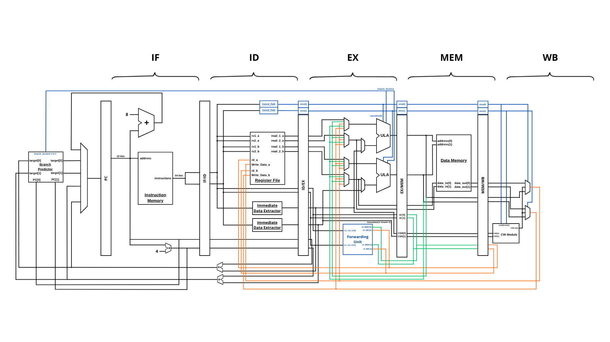

# riscv-superscalar

Development of a RISC-V superscalar processor as part of the *Projet Thématique* course at ENSEIRB-MATMECA.

This project focuses on the design and implementation of a dual-issue superscalar RISC-V processor. The repository covers the entire hardware development lifecycle, from RTL design and simulation to FPGA implementation and ASIC backend synthesis flow.

## Architecture Overview



The core is designed to maximize Instruction Per Cycle (IPC) throughput by fetching, decoding, and executing up to two instructions simultaneously.

**Key Architecture Features:**
- **Dual-Issue Superscalar:** Capable of dispatching two instructions per clock cycle.
- **5-Stage Pipeline:** Instruction Fetch (IF), Instruction Decode (ID), Execute (EX), Memory (MEM), and Write-Back (WB).
- **Branch Prediction:** Features a **Bimodal Branch Target Buffer (BTB)**. To optimize performance and hardware inference, branch decisions and target addresses are resolved and evaluated in the **EX stage**.
- **Hazard Management:** Full data forwarding logic to minimize pipeline stalls.

---

## Repository Structure

```text
riscv-superscalar/
├── asic/       # ASIC synthesis and physical design flow (Yosys/OpenROAD, etc.)
├── docs/       # Project documentation, architecture diagrams, and reports
├── fpga/       # FPGA implementation files, XDC constraints, and bitstream deployment
├── rtl/        # Core RTL VHDL source files (Frontend)
├── software/   # Test programs (C/Assembly), firmware, and compilation toolchains
├── tb/         # Testbenches and Simulation environments
```

---

## 1. Simulation

Functional verification and waveform analysis are handled in the `tb/` directory.

Currently, the simulation environment is built around a **Vivado Project** located in the `tb/` folder. Simply open the `.xpr` file in Vivado to run the testbenches.

> **Future Work:** Automate the Vivado simulation project creation using Tcl scripts to allow a seamless command-line simulation flow.

---

## 2. FPGA Implementation

The processor is fully synthesizable and tested on physical hardware (Xilinx Artix-7/Nexys A7). The Vivado project for synthesis, place & route, and bitstream generation is located in the `fpga/` directory.

> **Future Work:** Similar to the simulation environment, the GUI-based Vivado project will be replaced/complemented by automated Tcl scripts for batch-mode bitstream generation.

### Running on the FPGA (Hardware Flow)
To test the processor on the physical board, a Python workflow is provided to send machine code and retrieve memory dumps over UART.

**Execution Steps:**
1. Toggle **Switch 1** to the `ON` position to hold the processor in `Reset`.
2. Run the deployment script located in `fpga/scripts/`:
   ```bash
   python fpga/scripts/test.py
   ```
3. The script will send the compiled `.txt` code to the FPGA Instruction Memory.
4. Toggle **Switch 1** to `ON` to release the reset and start processor execution.
5. Once the program finishes, press the **Center Button (BTNC)** on the FPGA to trigger the "Memory Scan".
6. The Python script will receive the contents of the Data Memory and display the results in your terminal.

---

## 3. ASIC Conception

The backend flow for Application-Specific Integrated Circuit (ASIC) design is hosted in the `asic/` directory. This section will contain the synthesis (`synth/`), place and route (`par/`), and physical constraints (`constraints/`) required to map the RTL to a standard cell technology node.

*(Documentation for the ASIC flow is currently under development).*

---

## Authors

- Bruno Henrique Spies
- Mathias Michelotti
- Mathieu Escouteloup
